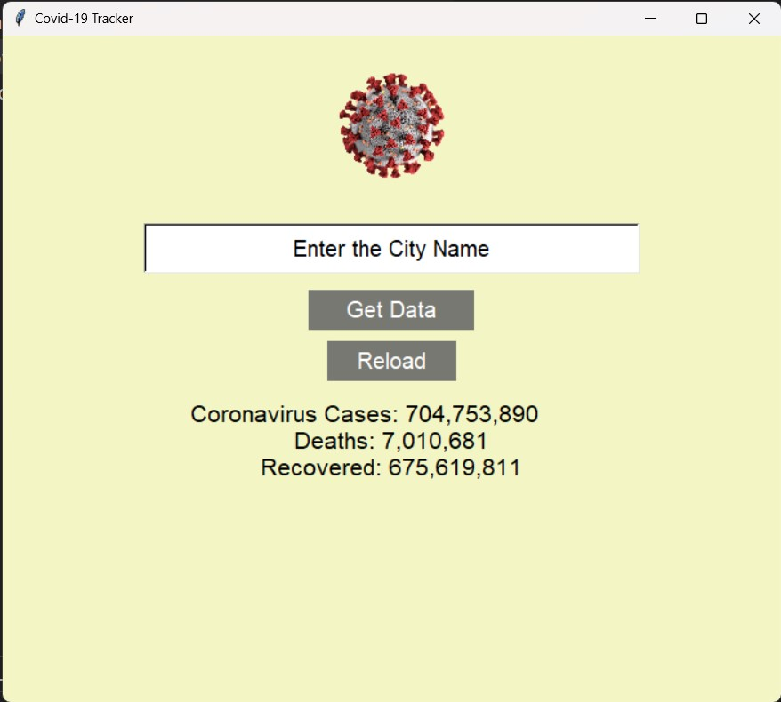

# COVID-19 Tracker App

The COVID-19 Tracker App is a Python-based application designed to provide real-time data on COVID-19 cases globally and facilitate the retrieval of data for specific countries. Developed using Tkinter for the graphical user interface (GUI) and BeautifulSoup for web scraping, this application offers users an intuitive and efficient way to stay informed about the ongoing pandemic.

## Features

- **Global COVID-19 Statistics Display**: Users can view comprehensive statistics on COVID-19 cases worldwide, including total confirmed cases, deaths, and recoveries.

- **Country-specific Data Retrieval**: The app allows users to retrieve detailed COVID-19 data for specific countries by entering the country name into a text entry field.

- **Reload Functionality**: Users can update the global COVID-19 statistics with the latest data by clicking the "Reload" button, ensuring that they have access to the most recent information.

## Screenshots

### Default Global Report


### Brazil COVID-19 Report


### Germany COVID-19 Report


## Getting Started

### Prerequisites

To run the COVID-19 Tracker App on your machine, you need to have Python 3.x installed, along with the following Python libraries: `requests`, `bs4`, and `tkinter`.

### Installation

1. Clone the repository to your local machine using the following command:

    ```bash
    git clone https://github.com/Rahul8959/Covid19_Tracker.git
    ```

2. Navigate to the project directory:

    ```bash
    cd Covid19_Tracker
    ```

3. Install the required dependencies by running:

    ```bash
    pip install -r requirements.txt
    ```

### Usage

1. Launch the application by running the following command:

    ```bash
    python Covid19.py
    ```

2. The application window will open, displaying the global COVID-19 statistics.

3. To retrieve COVID-19 data for a specific country, enter the country name into the text entry field and click the "Get Data" button.

4. To update the global COVID-19 statistics with the latest data, click the "Reload" button.

### Contact Information

For any inquiries or feedback, please contact [rahulshakya732@gmail.com](mailto:rahulshakya732@gmail.com).

---
